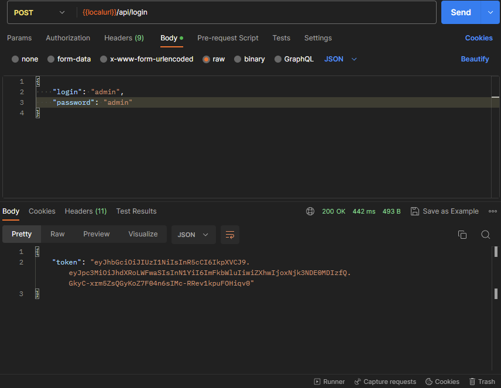
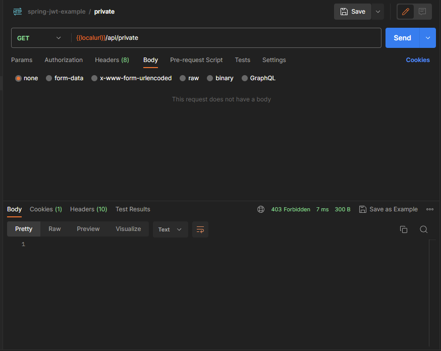
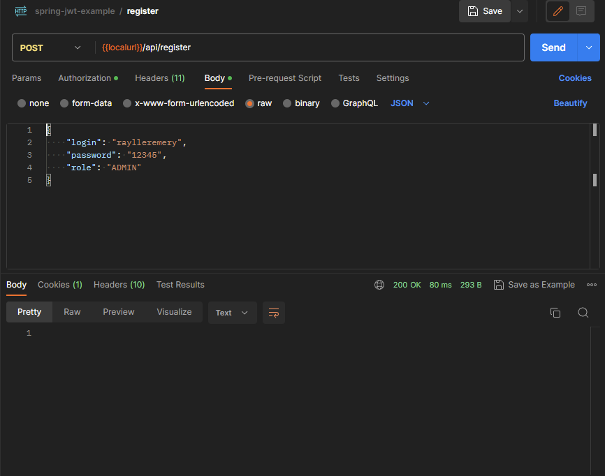
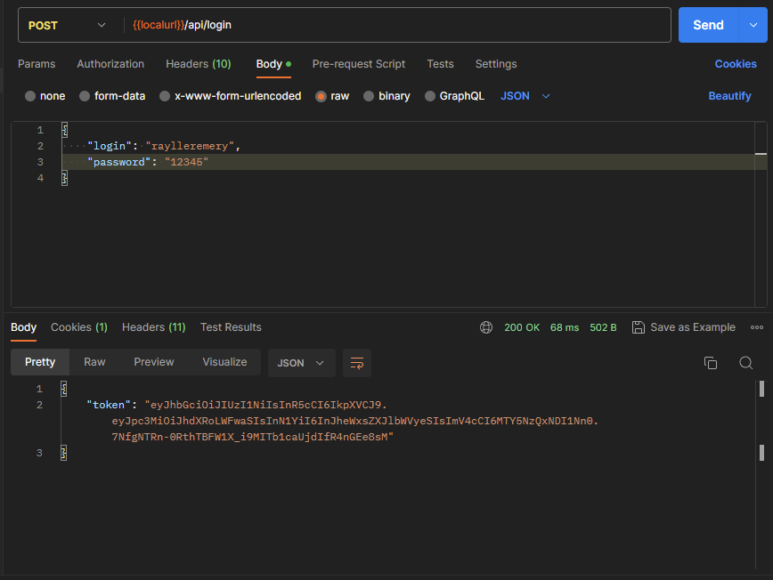

# Simple Spring Security 6 example authentication with JWT

This application apply some concepts of Spring Security 6 using JWT Authentication.
On start, the app will save a initial User with "admin" and password "admin" to we can use endpoints "/register" and "/login".

## Login

## Locked Endpoint

## Register Endpoint

## Login with new User

## Access endpoint with new User

